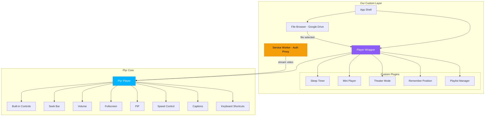
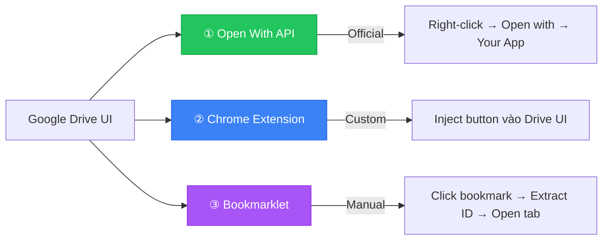
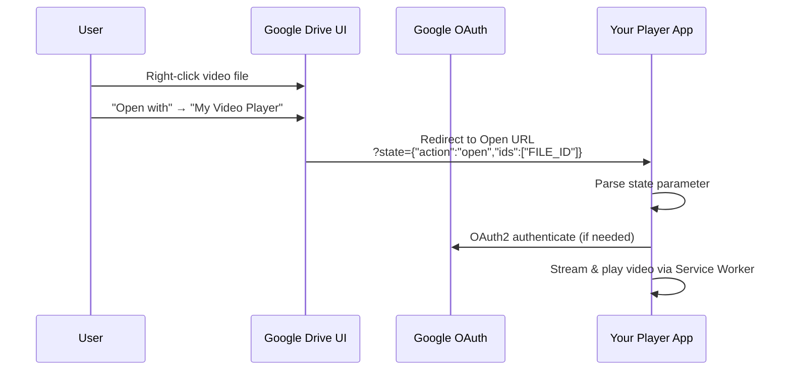
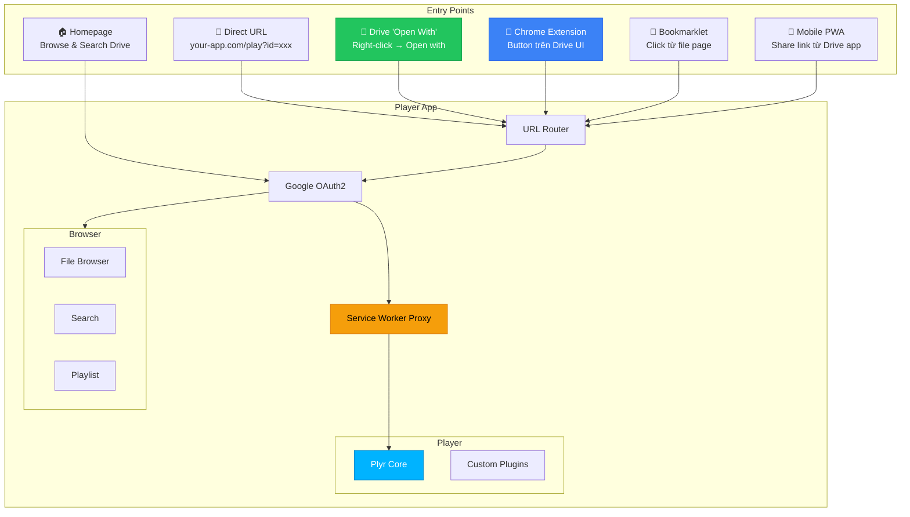

# 🎬 Google Drive Video Player — Phân Tích Cập Nhật

---

## 1. Đánh Giá Plyr.io

### 1.1 Plyr là gì?

**Plyr** (29.8k ⭐ GitHub) là một thư viện video/audio player mã nguồn mở, viết bằng vanilla ES6 JavaScript, hỗ trợ HTML5 Video, Audio, YouTube & Vimeo.

### 1.2 Features của Plyr

| Feature | Có sẵn? | Ghi chú |
|---|:---:|---|
| Custom controls UI | ✅ | Đẹp, clean, accessible |
| Fullscreen | ✅ | Native fullscreen + fallback |
| Picture-in-Picture | ✅ | Browser PiP API |
| Speed controls | ✅ | Built-in |
| Keyboard shortcuts | ✅ | Đầy đủ |
| VTT Captions/Subtitles | ✅ | Multi-track |
| Preview thumbnails | ✅ | Via plugin |
| Volume control | ✅ | Slider |
| Seek bar | ✅ | Với buffer indicator |
| Responsive | ✅ | Mobile-friendly |
| i18n | ✅ | Đa ngôn ngữ |
| Streaming (HLS/DASH) | ✅ | Via hls.js / dash.js / Shaka |
| CSS customizable | ✅ | CSS Custom Properties |
| API & Events | ✅ | Standardized across formats |
| Ads support | ✅ | Vi.ai integration |
| No dependencies | ✅ | Vanilla JS |

### 1.3 So sánh: Plyr vs Tự Build Custom Player

| Tiêu chí | Plyr | Custom Build |
|---|---|---|
| **Thời gian phát triển** | ⚡ Nhanh (vài giờ) | 🐌 Chậm (vài tuần) |
| **Bugs & Edge cases** | ✅ Đã xử lý (2321 commits) | ⚠️ Phải tự xử lý |
| **Accessibility** | ✅ WCAG compliant | ❌ Phải tự implement |
| **Browser compatibility** | ✅ Đã test rộng | ⚠️ Phải tự test |
| **Customization** | 🟡 CSS vars + config | ✅ Unlimited |
| **Bundle size** | ~30KB gzipped | Tuỳ |
| **Maintenance** | ⚠️ Phụ thuộc maintainer | ✅ Tự control |
| **Sleep timer** | ❌ Không có | ✅ Tự build |
| **Mini player** | ❌ Không có | ✅ Tự build |
| **Theater mode** | ❌ Không có | ✅ Tự build |
| **Remember position** | ❌ Không có | ✅ Tự build |

### 1.4 Verdict: CÓ NÊN DÙNG PLYR?

> [!TIP]
> **✅ CÓ — Plyr là lựa chọn tuyệt vời** cho project này. Lý do:
>
> 1. **Tiết kiệm 70-80% thời gian** phát triển player core
> 2. **Đã xử lý hàng trăm edge cases** mà tự build sẽ mất rất lâu
> 3. **Có thể mở rộng** — các feature Plyr không có (sleep timer, mini player, theater mode, remember position) có thể build thêm dưới dạng wrapper/plugin
> 4. **CSS Custom Properties** cho phép customize giao diện hoàn toàn
> 5. **Hỗ trợ HLS/DASH streaming** qua hls.js — quan trọng cho video lớn

### 1.5 Kiến trúc tích hợp Plyr



---

## 2. Mở Video Từ Google Drive UI

### 2.1 Câu hỏi của bạn
>
> *"Khi tôi đến folder chứa các file video trên Google Drive, có cách nào thao tác trên đó để mở video chạy trên website của tôi ra 1 tab mới không?"*

**Câu trả lời: CÓ — và có 3 cách tiếp cận**

### 2.2 So sánh 3 Phương Án



---

### Phương án ① — Google Drive "Open With" API ⭐ RECOMMENDED

**Cách hoạt động:**

1. Đăng ký web app của bạn với Google Drive API (Drive UI Integration)
2. App xuất hiện trong menu **"Open with"** khi right-click file trên Drive
3. User click → Google redirect đến app của bạn kèm `state` parameter chứa `fileId`
4. App parse `fileId` và phát video



**State parameter format khi Google Drive gọi app:**

```json
{
  "action": "open",
  "ids": ["1ABC2def3GHI4jkl5MNO"],
  "resourceKeys": {
    "1ABC2def3GHI4jkl5MNO": "resource_key_value"
  },
  "userId": "user_profile_id"
}
```

**Setup cần thiết:**

- Google Cloud Console → Drive API → **Drive UI Integration** tab
- Điền: App name, Open URL, MIME types (`video/*`), file extensions
- App phải deploy trên domain thật (không localhost)

| Ưu điểm | Nhược điểm |
|---|---|
| ✅ Official Google API | ❌ Cần deploy trên domain thật |
| ✅ Xuất hiện native trong Drive UI | ❌ Setup phức tạp hơn |
| ✅ Stable, không bị break | ❌ Có thể cần review nếu publish marketplace |
| ✅ Hoạt động trên mọi browser | |

---

### Phương án ② — Chrome Extension 🧩

**Cách hoạt động:**

1. Extension inject một nút/menu vào trang Google Drive
2. Khi click, extension extract `fileId` từ URL hoặc DOM
3. Mở tab mới: `https://your-player.com/play?id={fileId}`

```js
// Content script inject vào Google Drive page
// Detect khi user right-click hoặc select video file
// Extract fileId từ URL pattern: /file/d/{fileId}/
// Mở tab mới với player app
```

| Ưu điểm | Nhược điểm |
|---|---|
| ✅ UX mượt nhất | ❌ Chỉ Chrome/Edge |
| ✅ Có thể thêm nút tuỳ ý | ❌ Google Drive UI hay thay đổi → extension dễ break |
| ✅ Không cần deploy domain | ❌ Cần publish lên Chrome Web Store (hoặc load unpacked) |
| ✅ Có thể tự dùng (developer mode) | ❌ Maintain effort cao |

---

### Phương án ③ — Bookmarklet (Quick & Simple)

**Cách hoạt động:**

1. User tạo một bookmark với JavaScript code
2. Khi đang xem folder/file trên Drive, click bookmark
3. Script extract `fileId` từ URL → mở tab mới với player

```js
// Bookmarklet code (saved as bookmark):
javascript:void(function(){
  const m = location.href.match(/\/file\/d\/([a-zA-Z0-9_-]+)/);
  if(m) window.open('https://your-player.com/play?id=' + m[1]);
  else alert('No video file ID found in URL');
})()
```

| Ưu điểm | Nhược điểm |
|---|---|
| ✅ Zero setup | ❌ Phải mở file trước (vào trang preview) |
| ✅ Hoạt động mọi browser | ❌ UX không mượt |
| ✅ Không cần extension | ❌ Không hoạt động từ folder view |
| ✅ Dễ share | |

---

### 2.3 Kết Luận & Đề Xuất

> [!IMPORTANT]
> **Đề xuất tổ hợp tối ưu: Phương án ① + ② + URL Direct**
>
> | Ưu tiên | Phương án | Mục đích |
> |---|---|---|
> | **P0** | **URL Direct** | Paste Google Drive link → auto play |
> | **P1** | **① Open With API** | Right-click từ Drive → Open with → Player |
> | **P2** | **② Chrome Extension** | Nút play trực tiếp trên Drive UI |
> | **P3** | **③ Bookmarklet** | Fallback cho non-Chrome users |

---

## 3. Kiến Trúc Cập Nhật (với Plyr + Multi-Entry)

### 3.1 Flow Tổng Thể



### 3.2 URL Routing

```
https://your-player.com/                    → Homepage (browse Drive)
https://your-player.com/play?id={fileId}    → Direct play
https://your-player.com/play?url={driveUrl} → Parse URL → play
https://your-player.com/open?state={json}   → Google Drive "Open With" handler
https://your-player.com/folder?id={folderId} → Browse folder as playlist
```

### 3.3 Project Structure (Cập nhật)

```
gdrive-player/
├── index.html                    # Homepage / File browser
├── play.html                     # Player page (opened in new tab)
├── vite.config.js
├── package.json
├── public/
│   ├── manifest.webmanifest      # PWA metadata + share target
│   ├── sw.js                     # Service Worker (auth proxy + PWA shell cache)
│   └── icons/                    # PWA icons 192/512/maskable
├── src/
│   ├── main.js                   # Homepage entry
│   ├── player-main.js            # Player page entry
│   ├── styles/
│   │   ├── index.css             # Design tokens + global
│   │   ├── player.css            # Player customization (Plyr overrides)
│   │   ├── browser.css           # File browser
│   │   └── plugins.css           # Custom plugins
│   ├── core/
│   │   ├── auth.js               # Google OAuth2 (PKCE)
│   │   ├── drive.js              # Google Drive API
│   │   ├── storage.js            # localStorage manager
│   │   └── router.js             # URL parser (state, id, url)
│   ├── player/
│   │   ├── PlayerWrapper.js      # Plyr wrapper + plugin orchestrator
│   │   ├── plugins/
│   │   │   ├── SleepTimer.js     # Hẹn giờ ngủ
│   │   │   ├── MiniPlayer.js     # Floating mini player
│   │   │   ├── TheaterMode.js    # Wide view
│   │   │   ├── RememberPosition.js  # Save/restore position
│   │   │   ├── PlaylistUI.js     # Next/Prev + playlist panel
│   │   │   └── Annotations.js    # Chú thích
│   │   └── SettingsPanel.js      # Extended settings (beyond Plyr)
│   ├── browser/
│   │   ├── FileBrowser.js        # Google Drive browser
│   │   └── SearchBar.js          # Search files
│   └── utils/
│       ├── drive-url.js          # Parse various Drive URL formats
│       └── time.js               # Time formatting
│
├── extension/                     # Chrome Extension (separate)
│   ├── manifest.json
│   ├── drive-reference.js       # Parse Drive URL/fileId + build player URL
│   ├── content-script.js         # Inject button vào Drive
│   ├── background.js
│   ├── popup.html
│   ├── popup.js
│   ├── popup.css
│   └── icons/
│       ├── 16.png
│       ├── 32.png
│       ├── 48.png
│       └── 128.png
├── scripts/
│   └── check-extension.mjs       # Validate extension manifest/assets/scripts
│
└── README.md
```

---

## 4. Implementation Phases (Cập nhật)

### Phase 1: Core Player 🎯 (Ưu tiên cao nhất)

1. ✅ Setup Vite project
2. ✅ Google OAuth2 (PKCE flow)
3. ✅ Service Worker video proxy
4. ✅ **Plyr integration** với HTML5 `<video>`
5. ✅ URL Router (parse `?id=`, `?url=`, `?state=`)
6. ✅ Play page (`play.html`) — paste Drive link hoặc file ID → play

### Phase 2: Plyr Customization + Plugins ⚡

1. CSS theming (dark theme, accent colors)
2. Extended Settings Panel (Sleep timer, Theater mode)
3. Remember playback position (localStorage)
4. Playlist support (from Drive folder)
5. Mini player mode

### Phase 3: Google Drive Integration 📂

1. **"Open With" API** registration (Drive UI Integration)
2. State parameter handler
3. Built-in file browser (homepage)
4. Search functionality

### Phase 4: Chrome Extension 🧩

1. Content script: detect video files on Drive page
2. Inject "Open in Player" button
3. Extract fileId → open new tab with player

### Phase 5: Polish ✨

1. Responsive mobile design
2. Touch gestures
3. Loading states & error handling
4. Bookmarklet generator
5. Subtitle (.srt/.vtt) upload support

### Phase 6: Mobile PWA + Share Target 📱

1. Tạo `public/manifest.webmanifest` với `name`, `short_name`, `start_url`, `display`, `theme_color`, `background_color` và icons `192x192`, `512x512`, `maskable`.
2. Link manifest trong `index.html`:

   ```html
   <link rel="manifest" href="/manifest.webmanifest">
   <meta name="theme-color" content="#0f172a">
   ```

3. Mở rộng Service Worker để cache app shell cơ bản, nhưng vẫn giữ logic proxy video hiện tại và không cache access token lâu hơn cần thiết.
4. Thêm Web Share Target để Android có thể gửi link Drive vào app sau khi người dùng cài PWA:

   ```json
   {
     "share_target": {
       "action": "/share",
       "method": "GET",
       "params": {
         "title": "title",
         "text": "text",
         "url": "url"
       }
     }
   }
   ```

5. Thêm route `/share` để đọc `text` hoặc `url`, extract Google Drive file/folder ID, rồi điều hướng sang `/play?id=...` hoặc `/folder?id=...`.
6. Tối ưu mobile UX: install prompt, safe-area padding, full-screen player, touch controls và fallback "Dán link" khi Drive app chỉ có **Sao chép đường liên kết**.
7. Test trên Android Chrome sau khi install PWA: Drive app -> Share/Chia sẻ -> Nimbus Player -> video mở trong PWA. Ghi chú iOS có thể không hỗ trợ Web Share Target đầy đủ, nên vẫn cần fallback copy/paste link.

> [!NOTE]
> PWA không làm website xuất hiện trong menu **Mở trong/Open in** của Google Drive mobile như native app. PWA chủ yếu cải thiện luồng **Share/Chia sẻ link** và trải nghiệm mở app trên điện thoại.
